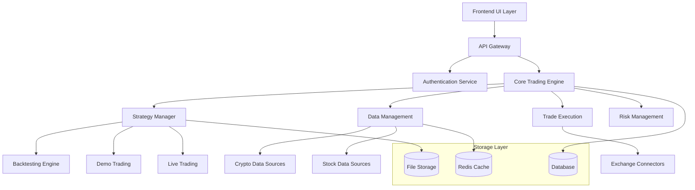

# Design Document

## Overview

This design document outlines the architecture for refactoring the AlgoProject AI-driven smart trading platform from its current state of 12,754+ Python files to a modular, maintainable system supporting crypto and stock trading with comprehensive backtesting, demo trading, and live trading capabilities.

## Architecture

### High-Level Architecture



### Directory Structure

The refactored codebase will follow this organized structure:

```
algoproject/
├── core/                    # Core trading engine and shared components
│   ├── __init__.py
│   ├── strategy_engine.py   # Dynamic strategy loading and execution
│   ├── kpi_calculator.py    # 29+ KPI calculations
│   ├── trade_executor.py    # Trade execution logic
│   ├── risk_manager.py      # Risk management and position sizing
│   └── config_manager.py    # Configuration management
├── ui/                      # Frontend interface
│   ├── __init__.py
│   ├── app.py              # Flask/FastAPI main application
│   ├── auth.py             # Google OAuth integration
│   ├── routes/             # API route definitions
│   ├── templates/          # HTML templates (if using server-side rendering)
│   └── static/             # CSS, JS, images
├── data/                    # Data management and processing
│   ├── __init__.py
│   ├── data_loader.py      # Unified data loading interface
│   ├── cache_manager.py    # Data caching and optimization
│   ├── historical_data.py  # Historical data fetching and storage
│   └── live_data.py        # Real-time data streaming
├── strategies/              # Dynamic strategy modules
│   ├── __init__.py
│   ├── base_strategy.py    # Abstract base strategy class
│   ├── momentum/           # Momentum-based strategies
│   ├── mean_reversion/     # Mean reversion strategies
│   ├── arbitrage/          # Arbitrage strategies
│   └── custom/             # User-defined strategies
├── backtest/               # Backtesting system
│   ├── __init__.py
│   ├── engine.py           # Main backtesting engine
│   ├── runner.py           # Batch backtest runner
│   ├── config.py           # Backtest configuration
│   └── reporting.py        # Results analysis and reporting
├── crypto/                 # Crypto-specific functionality
│   ├── __init__.py
│   ├── exchanges/          # Exchange-specific implementations
│   ├── output/             # Results, charts, logs
│   ├── input/              # Configuration files, crypto pairs
│   ├── logs/               # Log files
│   ├── scripts/            # Backend callable scripts
│   ├── tools/              # Test and utility scripts
│   └── docs/               # Documentation and guides
├── stocks/                 # Stock-specific functionality
│   ├── __init__.py
│   ├── brokers/            # Broker-specific implementations (Fyers)
│   ├── output/             # Results, charts, logs
│   ├── input/              # Configuration files, stock symbols
│   ├── logs/               # Log files
│   ├── scripts/            # Backend callable scripts
│   ├── tools/              # Test and utility scripts
│   └── docs/               # Documentation and guides
├── config/                 # Configuration files
│   ├── app_config.yaml     # Main application configuration
│   ├── strategy_config.yaml # Strategy parameters
│   ├── exchange_config.yaml # Exchange API configurations
│   └── thresholds.yaml     # Performance thresholds
├── tests/                  # Test suite
├── docs/                   # Project documentation
└── requirements.txt        # Python dependencies
```

## Components and Interfaces

### 1. Core Trading Engine

**Purpose**: Central coordinator for all trading activities

**Key Classes**:
- `StrategyEngine`: Manages strategy loading, execution, and lifecycle
- `KPICalculator`: Computes 29+ performance metrics
- `TradeExecutor`: Handles order placement and management
- `RiskManager`: Implements position sizing and risk controls

**Interfaces**:
```python
class IStrategy:
    def initialize(self, context: TradingContext) -> None
    def next(self, data: MarketData) -> List[Signal]
    def get_parameters(self) -> Dict[str, Any]

class IDataProvider:
    def get_historical_data(self, symbol: str, timeframe: str, bars: int) -> DataFrame
    def get_live_data(self, symbol: str) -> MarketData
    def get_available_symbols(self, exchange: str) -> List[str]
```

### 2. Strategy Management System

**Dynamic Strategy Loading**:
- Strategies defined as classes inheriting from `BaseStrategy`
- Configuration-driven parameter management
- Runtime strategy validation and testing
- Hot-swapping capabilities for live trading

**Strategy Categories**:
- Momentum strategies (trend following, breakout)
- Mean reversion strategies (RSI, Bollinger Bands)
- Arbitrage strategies (cross-exchange, statistical)
- Custom user-defined strategies

### 3. Backtesting Engine

**Multi-Asset, Multi-Strategy Framework**:
```python
class BacktestEngine:
    def run_matrix_backtest(
        self, 
        strategies: List[str], 
        assets: List[str], 
        timeframes: List[str],
        start_date: datetime,
        end_date: datetime
    ) -> BacktestResults
```

**KPI Calculation** (29+ metrics):
- Return Metrics: Final Return %, CAGR %, Total Return
- Risk Metrics: Sharpe Ratio, Sortino Ratio, Calmar Ratio
- Trade Metrics: Win Rate %, Avg Trade %, Expectancy %
- Drawdown Metrics: Max Drawdown %, Avg Drawdown %
- Volatility Metrics: Annualized Volatility, Beta
- Duration Metrics: Avg Trade Duration, Max Trade Duration

**Performance Ranking System**:
```python
def calculate_star_rating(profit_factor: float, sharpe_ratio: float) -> str:
    if profit_factor >= 1.5 and sharpe_ratio >= 1.5:
        return "⭐⭐⭐⭐⭐"
    elif profit_factor >= 1.2 and sharpe_ratio >= 1.0:
        return "⭐⭐⭐⭐"
    elif profit_factor >= 1.0:
        return "⭐⭐⭐"
    else:
        return "❌"
```

### 4. Data Management Layer

**Unified Data Interface**:
- Single interface for both crypto and stock data
- Intelligent caching with Redis
- Historical data management with efficient storage
- Real-time data streaming with WebSocket connections

**Data Sources**:
- Crypto: CCXT-supported exchanges (Binance, Bybit, etc.)
- Stocks: Fyers API integration
- Alternative data sources for enhanced analysis

### 5. User Interface and API Layer

**Authentication**:
- Google OAuth 2.0 integration
- Secure session management
- Role-based access control

**API Endpoints**:
```python
# User Management
POST /api/auth/login
GET /api/user/profile
PUT /api/user/preferences

# Asset Management
GET /api/exchanges
GET /api/exchanges/{exchange}/assets
GET /api/exchanges/{exchange}/pairs

# Backtesting
POST /api/backtest/run
GET /api/backtest/results/{id}
GET /api/backtest/compare

# Trading
POST /api/demo/start
GET /api/demo/status
POST /api/live/start
GET /api/live/positions
```

**Frontend Components**:
- Dashboard with performance overview
- Strategy comparison tables with star ratings
- Interactive charts for equity curves and drawdowns
- Real-time trading interface
- Configuration management panels

## Data Models

### Core Data Structures

```python
@dataclass
class TradingPair:
    symbol: str
    base_asset: str
    quote_asset: str
    exchange: str
    asset_class: str  # spot, futures, options
    min_quantity: float
    tick_size: float

@dataclass
class Strategy:
    name: str
    class_name: str
    parameters: Dict[str, Any]
    description: str
    category: str
    risk_level: int

@dataclass
class BacktestResult:
    strategy: str
    asset: str
    timeframe: str
    start_date: datetime
    end_date: datetime
    kpis: Dict[str, float]
    trades: List[Trade]
    equity_curve: List[float]
    star_rating: str

@dataclass
class Trade:
    timestamp: datetime
    symbol: str
    side: str  # buy/sell
    quantity: float
    price: float
    commission: float
    pnl: float
```

### Database Schema

**Users Table**:
- user_id, email, name, google_id
- preferences (JSON), created_at, last_login

**Strategies Table**:
- strategy_id, name, class_name, parameters (JSON)
- category, risk_level, created_by, is_active

**Backtests Table**:
- backtest_id, user_id, strategy_id, symbol, timeframe
- start_date, end_date, results (JSON), created_at

**Trades Table**:
- trade_id, backtest_id, timestamp, symbol, side
- quantity, price, commission, pnl

## Error Handling

### Exception Hierarchy
```python
class AlgoProjectException(Exception):
    pass

class DataException(AlgoProjectException):
    pass

class StrategyException(AlgoProjectException):
    pass

class ExecutionException(AlgoProjectException):
    pass

class APIException(AlgoProjectException):
    pass
```

### Error Recovery Strategies
- Graceful degradation for data source failures
- Automatic retry mechanisms with exponential backoff
- Circuit breaker pattern for external API calls
- Comprehensive logging and monitoring

## Testing Strategy

### Test Categories
1. **Unit Tests**: Individual component testing
2. **Integration Tests**: API and database integration
3. **Strategy Tests**: Backtesting validation
4. **Performance Tests**: Load and stress testing
5. **Security Tests**: Authentication and authorization

### Test Data Management
- Mock data generators for backtesting
- Sandbox environments for live trading tests
- Automated test data cleanup

## Deployment and Scalability

### Containerization
- Docker containers for each service
- Docker Compose for local development
- Kubernetes for production deployment

### Scalability Considerations
- Horizontal scaling for backtesting workers
- Database sharding for historical data
- CDN for static assets and charts
- Load balancing for API endpoints

### Monitoring and Observability
- Application performance monitoring (APM)
- Real-time alerting for system issues
- Comprehensive logging with structured formats
- Health check endpoints for all services