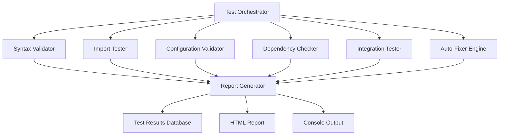

# Design Document - Comprehensive System Testing

## Overview

The comprehensive system testing feature will implement a robust, automated testing framework for the AlgoProject trading platform. This system will validate all Python modules, configuration files, dependencies, and integrations across the crypto and stock trading components. The design focuses on creating a self-healing system that can detect, report, and automatically fix common issues while providing detailed diagnostics for complex problems.

The testing framework will be built as a modular system that can run comprehensive validation, targeted testing, and continuous monitoring of the trading platform's health.

## Architecture

### High-Level Architecture



### Component Architecture

The system will be organized into the following main components:

1. **Test Orchestrator**: Central coordinator that manages test execution flow
2. **Validation Engines**: Specialized validators for different aspects of the system
3. **Auto-Fixer Engine**: Automated repair system for common issues
4. **Reporting System**: Comprehensive reporting and logging capabilities
5. **Configuration Manager**: Handles test configuration and settings

## Components and Interfaces

### 1. Test Orchestrator (`comprehensive_test_orchestrator.py`)

**Purpose**: Central coordinator for all testing activities

**Key Methods**:
- `run_comprehensive_test()`: Execute full system validation
- `run_targeted_test(component)`: Test specific components
- `run_continuous_monitoring()`: Background health monitoring
- `generate_test_plan()`: Create dynamic test execution plans

**Interfaces**:
- Input: Test configuration, component selection
- Output: Test results, execution status
- Dependencies: All validation engines

### 2. Syntax Validator (`syntax_validator.py`)

**Purpose**: Validate Python syntax and code quality

**Key Methods**:
- `validate_python_files()`: Check all .py files for syntax errors
- `check_import_statements()`: Validate import syntax
- `validate_code_structure()`: Check for proper class/function definitions
- `fix_common_syntax_errors()`: Auto-repair basic syntax issues

**Validation Rules**:
- Python syntax compliance (AST parsing)
- Import statement validation
- Indentation consistency
- Bracket/parentheses matching
- String quote consistency

### 3. Import Tester (`import_tester.py`)

**Purpose**: Test module imports and dependency resolution

**Key Methods**:
- `test_all_imports()`: Attempt to import all modules
- `check_circular_dependencies()`: Detect circular import issues
- `validate_module_interfaces()`: Check __init__.py files
- `resolve_import_conflicts()`: Fix import path issues

**Testing Strategy**:
- Isolated import testing in subprocess
- Dependency graph analysis
- Module interface validation
- Import path resolution

### 4. Configuration Validator (`config_validator.py`)

**Purpose**: Validate configuration files and data formats

**Key Methods**:
- `validate_yaml_configs()`: Check YAML file syntax and structure
- `validate_csv_assets()`: Verify asset list formats
- `validate_json_configs()`: Check JSON configuration files
- `fix_config_formats()`: Auto-repair configuration issues

**Supported Formats**:
- YAML configuration files
- CSV asset lists
- JSON settings files
- Python configuration modules

### 5. Dependency Checker (`dependency_checker.py`)

**Purpose**: Verify external dependencies and package installations

**Key Methods**:
- `check_required_packages()`: Verify all requirements.txt packages
- `validate_package_versions()`: Check version compatibility
- `check_system_dependencies()`: Verify system-level requirements
- `generate_dependency_report()`: Create dependency status report

**Checks**:
- Python package availability
- Version compatibility matrix
- Optional dependency handling
- System-level dependencies

### 6. Integration Tester (`integration_tester.py`)

**Purpose**: Test module interactions and API integrations

**Key Methods**:
- `test_crypto_integration()`: Test CCXT and crypto modules
- `test_stock_integration()`: Test Fyers and stock modules
- `test_strategy_integration()`: Test strategy execution
- `test_data_flow()`: Validate data pipeline integrity

**Integration Points**:
- CCXT exchange connections
- Fyers API integration
- Strategy execution pipeline
- Data acquisition workflows

### 7. Auto-Fixer Engine (`auto_fixer.py`)

**Purpose**: Automatically repair common issues

**Key Methods**:
- `fix_syntax_errors()`: Repair basic syntax issues
- `fix_import_statements()`: Add missing imports
- `fix_configuration_formats()`: Repair config file formats
- `apply_code_formatting()`: Standardize code formatting

**Auto-Fix Capabilities**:
- Missing import statements
- Basic syntax errors (quotes, brackets)
- Configuration file formatting
- File permission issues
- Directory structure creation

### 8. Report Generator (`report_generator.py`)

**Purpose**: Generate comprehensive test reports

**Key Methods**:
- `generate_html_report()`: Create detailed HTML report
- `generate_console_summary()`: Display console summary
- `create_test_history()`: Maintain historical test data
- `export_results()`: Export results in various formats

**Report Features**:
- Interactive HTML dashboard
- Detailed error descriptions
- Fix recommendations
- Historical trend analysis
- Component health scores

## Data Models

### Test Result Model

```python
@dataclass
class TestResult:
    component: str
    test_name: str
    status: TestStatus  # PASS, FAIL, WARNING, SKIPPED
    message: str
    details: Dict[str, Any]
    timestamp: datetime
    execution_time: float
    auto_fixed: bool
    severity: Severity  # CRITICAL, HIGH, MEDIUM, LOW
```

### System Health Model

```python
@dataclass
class SystemHealth:
    overall_score: float  # 0-100
    component_scores: Dict[str, float]
    critical_issues: List[TestResult]
    warnings: List[TestResult]
    last_test_time: datetime
    trend: HealthTrend  # IMPROVING, STABLE, DEGRADING
```

### Configuration Schema

```python
@dataclass
class TestConfiguration:
    enabled_tests: List[str]
    auto_fix_enabled: bool
    severity_threshold: Severity
    timeout_seconds: int
    parallel_execution: bool
    report_formats: List[str]
    notification_settings: Dict[str, Any]
```

## Error Handling

### Error Categories

1. **Critical Errors**: System-breaking issues that prevent operation
   - Syntax errors in core modules
   - Missing critical dependencies
   - Configuration corruption

2. **High Priority Errors**: Significant issues affecting functionality
   - Import failures in non-critical modules
   - API connection failures
   - Data format inconsistencies

3. **Medium Priority Warnings**: Issues that may cause problems
   - Deprecated function usage
   - Performance concerns
   - Minor configuration issues

4. **Low Priority Notices**: Informational items
   - Code style inconsistencies
   - Optimization opportunities
   - Documentation gaps

### Error Recovery Strategy

1. **Immediate Recovery**: Auto-fix common issues during testing
2. **Graceful Degradation**: Continue testing even when components fail
3. **Detailed Reporting**: Provide actionable error information
4. **Rollback Capability**: Undo auto-fixes if they cause issues

## Testing Strategy

### Test Execution Phases

1. **Pre-Flight Checks**: Basic system validation
   - Python environment verification
   - Directory structure validation
   - Critical file existence checks

2. **Syntax Validation**: Code quality checks
   - Python syntax validation
   - Import statement verification
   - Code structure analysis

3. **Dependency Resolution**: Package and import testing
   - Required package verification
   - Import testing in isolation
   - Circular dependency detection

4. **Configuration Validation**: Settings and data verification
   - Configuration file parsing
   - Data format validation
   - Schema compliance checking

5. **Integration Testing**: Component interaction validation
   - API connectivity testing
   - Module interaction verification
   - Data flow validation

6. **Performance Validation**: System performance checks
   - Import time measurement
   - Memory usage analysis
   - Resource utilization monitoring

### Test Execution Modes

1. **Comprehensive Mode**: Full system validation (default)
2. **Quick Mode**: Essential checks only
3. **Targeted Mode**: Specific component testing
4. **Continuous Mode**: Background monitoring
5. **Fix-Only Mode**: Auto-repair without full testing

### Parallel Execution Strategy

- Independent tests run in parallel for speed
- Dependent tests run in sequence
- Resource-intensive tests are throttled
- Results are aggregated safely

## Implementation Considerations

### Performance Optimization

- **Caching**: Cache test results for unchanged files
- **Incremental Testing**: Only test modified components
- **Parallel Execution**: Run independent tests concurrently
- **Resource Management**: Monitor and limit resource usage

### Extensibility

- **Plugin Architecture**: Allow custom test modules
- **Configuration-Driven**: Enable/disable tests via configuration
- **Custom Validators**: Support for project-specific validation rules
- **Integration Hooks**: Allow external tools to integrate

### Security Considerations

- **Safe Execution**: Run tests in isolated environments
- **Credential Protection**: Avoid exposing sensitive information
- **File System Safety**: Prevent unauthorized file modifications
- **Input Validation**: Sanitize all external inputs

### Monitoring and Alerting

- **Health Metrics**: Track system health over time
- **Trend Analysis**: Identify degrading components
- **Alert Thresholds**: Configurable alerting rules
- **Integration**: Support for external monitoring systems

## Project Structure Analysis

### Current AlgoProject Structure

The AlgoProject is organized as a dual-audience platform serving both crypto and stock traders, with shared components:

```
AlgoProject/
├── 🚀 ENTRY POINTS
│   ├── main.py                    # Unified platform launcher
│   ├── crypto_launcher.py         # Crypto-focused launcher
│   └── crypto_main.py            # Direct crypto entry point
│
├── 💰 CRYPTO TRADING (Audience 1)
│   ├── crypto/
│   │   ├── __init__.py
│   │   ├── data_acquisition.py    # CCXT integration
│   │   ├── crypto_assets_manager.py
│   │   ├── crypto_symbol_manager.py
│   │   ├── backtest_config.py
│   │   ├── input/                 # Crypto configurations
│   │   │   ├── crypto_assets.csv
│   │   │   └── config_crypto.yaml
│   │   ├── output/               # Crypto results
│   │   ├── logs/                 # Crypto logs
│   │   ├── scripts/              # Crypto-specific scripts
│   │   └── tools/                # Crypto utilities
│   │
├── 📈 STOCK TRADING (Audience 2)
│   ├── stocks/
│   │   ├── __init__.py
│   │   ├── data_acquisition.py    # Fyers/Yahoo Finance
│   │   ├── fyers_data_provider.py
│   │   ├── simple_fyers_provider.py
│   │   ├── live_nse_quotes.py
│   │   ├── input/                 # Stock configurations
│   │   │   └── stocks_assets.csv
│   │   ├── output/               # Stock results
│   │   ├── logs/                 # Stock logs
│   │   ├── scripts/              # Stock-specific scripts
│   │   └── fyers/                # Fyers API integration
│   │       └── access_token.py
│   │
├── 🧠 SHARED STRATEGIES (Common)
│   ├── strategies/
│   │   ├── __init__.py
│   │   ├── ml_ai_framework.py     # AI/ML strategies
│   │   ├── market_inefficiency_strategy.py
│   │   ├── advanced_strategy_hub.py
│   │   ├── VWAPSigma2Strategy.py
│   │   ├── bb_rsi_strategy.py
│   │   ├── macd_only_strategy.py
│   │   └── sma_cross.py
│   │
├── 🛠️ SHARED TOOLS (Common)
│   ├── tools/
│   │   ├── __init__.py
│   │   ├── launcher.py            # Unified launcher
│   │   ├── backtest_runner.py     # Cross-platform backtesting
│   │   ├── realtime_trader.py     # Live trading engine
│   │   ├── scanner.py             # Market scanner
│   │   ├── technical_analysis.py  # TA indicators
│   │   └── system_verification.py # Health checks
│   │
├── 🔧 UTILITIES (Common)
│   ├── utils/
│   │   ├── data_acquisition.py    # Generic data utils
│   │   ├── crypto_symbol_manager.py
│   │   ├── stock_symbol_manager.py
│   │   └── symbol_validator.py
│   │
├── 📚 DOCUMENTATION (Separated)
│   ├── docs/
│   │   ├── 🌐 PLATFORM (Website/Startup)
│   │   │   ├── startup_vision.md
│   │   │   ├── BUSINESS_MODEL.md
│   │   │   ├── PRODUCT_REQUIREMENTS.md
│   │   │   ├── PRODUCT_ROADMAP.md
│   │   │   ├── UI_UX_DESIGN.md
│   │   │   └── STARTUP_LAUNCH_STRATEGY.md
│   │   │
│   │   ├── 💰 CRYPTO DOCS
│   │   │   ├── crypto-module.md
│   │   │   ├── crypto-README.md
│   │   │   ├── ENHANCED_CRYPTO_BACKTEST_FEATURES.md
│   │   │   └── DELTA_EXCHANGE_COMPLETE_SUMMARY.md
│   │   │
│   │   ├── 📈 STOCK DOCS
│   │   │   ├── stocks-module.md
│   │   │   ├── FYERS_SETUP.md
│   │   │   ├── FYERS_REFACTORING_COMPLETED.md
│   │   │   └── NSE_DATA_MIGRATION.md
│   │   │
│   │   ├── 🧠 STRATEGY DOCS
│   │   │   ├── strategies-module.md
│   │   │   └── validate_strategies.py
│   │   │
│   │   └── 🔧 TECHNICAL DOCS
│   │       ├── PROJECT_STRUCTURE.md
│   │       ├── GETTING_STARTED.md
│   │       ├── INSTALLATION.md
│   │       ├── coding_rules.md
│   │       └── SETUP_GUIDE.md
│   │
├── 🧪 TESTING & HELPERS
│   ├── helper_scripts/           # System utilities
│   │   ├── system_validation.py
│   │   ├── quick_status.py
│   │   └── comprehensive_test_suite.py
│   │
└── 📦 ENVIRONMENT
    ├── requirements.txt          # Python dependencies
    ├── setup.bat                # Windows setup
    ├── venv/                    # Virtual environment
    └── README.md                # Main project README
```

## Testing Framework File Organization

The comprehensive system testing framework will be organized to respect this dual-audience structure:

```
comprehensive_system_testing/
├── 🎯 CORE TESTING ENGINE
│   ├── core/
│   │   ├── test_orchestrator.py      # Main coordinator
│   │   ├── syntax_validator.py       # Python syntax validation
│   │   ├── import_tester.py          # Import testing
│   │   ├── config_validator.py       # Configuration validation
│   │   ├── dependency_checker.py     # Package dependencies
│   │   ├── integration_tester.py     # API integrations
│   │   └── auto_fixer.py            # Automated repairs
│   │
├── 💰 CRYPTO-SPECIFIC TESTING
│   ├── crypto_tests/
│   │   ├── ccxt_integration_test.py  # CCXT exchange testing
│   │   ├── crypto_config_test.py     # Crypto configurations
│   │   ├── crypto_strategy_test.py   # Crypto strategy validation
│   │   └── crypto_data_test.py       # Crypto data pipeline
│   │
├── 📈 STOCK-SPECIFIC TESTING
│   ├── stock_tests/
│   │   ├── fyers_integration_test.py # Fyers API testing
│   │   ├── nse_data_test.py         # NSE data validation
│   │   ├── stock_config_test.py     # Stock configurations
│   │   └── stock_strategy_test.py   # Stock strategy validation
│   │
├── 🧠 SHARED COMPONENT TESTING
│   ├── shared_tests/
│   │   ├── strategy_framework_test.py # Strategy engine testing
│   │   ├── tools_integration_test.py  # Tools validation
│   │   ├── utils_validation_test.py   # Utilities testing
│   │   └── cross_platform_test.py     # Cross-platform features
│   │
├── 📊 REPORTING & OUTPUT
│   ├── reporting/
│   │   ├── report_generator.py       # Main report generator
│   │   ├── crypto_report_template.py # Crypto-specific reports
│   │   ├── stock_report_template.py  # Stock-specific reports
│   │   ├── html_templates/
│   │   │   ├── crypto_dashboard.html
│   │   │   ├── stock_dashboard.html
│   │   │   └── unified_dashboard.html
│   │   └── export_formats/
│   │       ├── json_exporter.py
│   │       ├── csv_exporter.py
│   │       └── pdf_exporter.py
│   │
├── ⚙️ CONFIGURATION
│   ├── config/
│   │   ├── test_config.yaml          # Main test configuration
│   │   ├── crypto_test_rules.json    # Crypto-specific rules
│   │   ├── stock_test_rules.json     # Stock-specific rules
│   │   ├── validation_rules.json     # General validation rules
│   │   └── fix_patterns.yaml         # Auto-fix patterns
│   │
├── 🛠️ UTILITIES
│   ├── utils/
│   │   ├── file_utils.py            # File operations
│   │   ├── process_utils.py         # Process management
│   │   ├── validation_utils.py      # Validation helpers
│   │   ├── crypto_test_utils.py     # Crypto testing utilities
│   │   └── stock_test_utils.py      # Stock testing utilities
│   │
└── 🧪 TEST VALIDATION
    ├── tests/
    │   ├── unit_tests/              # Unit tests for testing framework
    │   ├── integration_tests/       # Integration tests
    │   ├── test_data/              # Test data samples
    │   │   ├── crypto_test_data/
    │   │   └── stock_test_data/
    │   └── mock_data/              # Mock API responses
```

### Testing Strategy by Audience

**Crypto Audience Testing Focus:**
- CCXT exchange connectivity and API limits
- Crypto asset validation and symbol management
- Cryptocurrency-specific strategies and indicators
- Crypto configuration files and data formats
- Exchange-specific error handling

**Stock Audience Testing Focus:**
- Fyers API integration and authentication
- NSE/BSE data validation and live quotes
- Stock-specific strategies and market hours
- Stock configuration files and asset lists
- Indian market-specific error handling

**Shared Component Testing:**
- Strategy framework compatibility across both markets
- Common tools and utilities functionality
- Cross-platform launcher and entry points
- Shared documentation and setup processes
- Universal error handling and logging

This design provides a comprehensive, maintainable, and extensible testing framework that addresses all requirements while respecting the dual-audience nature of the AlgoProject trading platform.